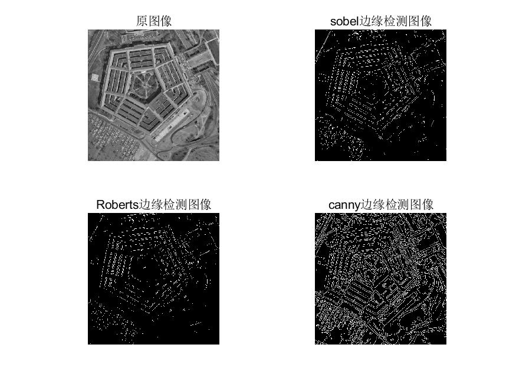

# 第七次作业

### 班级：自动化64

### 姓名：张晟

### 学号：2160504107

### 日期：2019/5/16

### 摘要

本次作业主要考察边缘检测和直线检测的相关算法。

### 第一题

#### 题目重述

首先对测试图像（文件名为：test1~test6）进行边缘检测，可采用书上介绍的Sobel等模板或者cann算子方法；

#### 思路

本题使用sobel，roberts和canny三种边缘检测算法。

Roberts算子，又称罗伯茨算子，是一种最简单的算子，是一种利用局部差分算子寻找边缘的算子。他采用对角线方向相邻两象素之差近似梯度幅值检测边缘。检测垂直边缘的效果好于斜向边缘，定位精度高，对噪声敏感,无法抑制噪声的影响。

Sobel算法是像素图像边缘检测中最重要的算子之一，在机器学习、数字媒体、计算机视觉等信息科技领域起着举足轻重的作用。在技术上，它是一个离散的一阶差分算子，用来计算图像亮度函数的一阶梯度之近似值。在图像的任何一点使用此算子，将会产生该点对应的梯度矢量或是其法矢量。

Canny边缘检测算法可以分为以下5个步骤：

1)        使用高斯滤波器，以平滑图像，滤除噪声。

2)        计算图像中每个像素点的梯度强度和方向。

3)        应用非极大值（Non-Maximum Suppression）抑制，以消除边缘检测带来的杂散响应。

4)        应用双阈值（Double-Threshold）检测来确定真实的和潜在的边缘。

5)        通过抑制孤立的弱边缘最终完成边缘检测。

具体算法参考课本教程，不再重复。

#### 结果

test1结果

test2结果

test3结果

test4结果

test5结果

test6结果

#### 分析

按照题目要求，使用三种不同算子对test1~test6的图像进行了边缘检测。结果较好，符合预期。

### 第二题

#### 题目重述

在边缘检测的基础上，用hough变换检测图中直线；

#### 思路

Hough变换原理

在二维平面上，可以用y=ax+b表示以a为斜率b为截距的直线。将其变形为b=-ax+y则原本共线点(x1,y1)...(xn,yn)会变成交于一点的多条直线，交点为(a,b)此时由于仍不能解决竖直方向的直线（斜率无穷大），引入ρ和θ，表示为xcosθ+ysinθ=ρ。在新平面上，表示为多个正弦曲线交于同一点，（ρ，θ）。具体计算时，可以将参数空间视为离散的。建立一个二维累加数组A(a,b),第一维的范围是图像坐标空间中直线斜率的可能范围，第二维的范围是图像坐标空间中直线截矩的可能范围。开始时A(a,b)初始化为0，然后对图像坐标空间的每一个前景点(xi,yi),将参数空间中每一个a的离散值代入式子(2)中，从而计算出对应的b值。每计算出一对(a,b),都将对应的数组元素A(a,b)加1，即A(a,b)=A(a,b)+1。所有的计算结束之后，在参数计算表决结果中找到A(a,b)的最大峰值，所对应的a0、b0就是原图像中共线点数目最多(共A(a,b)个共线点)的直线方程的参数；接下来可以继续寻找次峰值和第3峰值和第4峰值等等，它们对应于原图中共线点略少一些的直线。

#### 结果

使用test2的Robert边缘检测结果

#### 分析

Hough变换能够很快的提取出图像中的直线部分，而且精度也很高，结果图像中的直线较好的描出了物体的轮廓。

### 第三题

#### 题目重述

比较不同边缘检测算法（2种以上）、不同hough变换参数对直线检测的影响；

#### 思路

接第二问使用不同的参数进行Hough变换比较结果。

分别变换ρ和θ得出结果。

#### 结果

ρ=2，θ=4

ρ=0.5，θ=4

ρ=2，θ=0.5

ρ=0.5，θ=0.5

#### 分析

以上各种边缘检测算法中，canny算法精度最高，canny算法能反应出图像的细节边缘，在轻微变化的细节处也有较好的的显示，唯一的不足是所需要的计算时间太长。Robert和sobel变换都能一定程度上地提取出图像的细节，但是不如canny算法的效果好，例如第一题的图test1中，明显看到房屋中央有一部分空白，test6中人影上半部分没有描出来，test4中，棋盘有一部分没有描绘出来。但是在某些情况下，canny算法的细节过多，反而显得冗杂，例如test2中，图像由几个简单形状的几何体组成，canny算法描绘出了几何体上的一些花纹，反而不利于判断。Sobel算子检测方法对灰度渐变和噪声较多的图像处理效果较好，sobel算子对边缘定位不是很准确，图像的边缘不止一个像素；当对精度要求不是很高时，是一种较为常用的边缘检测方法。Canny方法不容易受噪声干扰，能够检测到真正的弱边缘。优点在于，使用两种不同的阈值分别检测强边缘和弱边缘，并且当弱边缘和强边缘相连时，才将弱边缘包含在输出图像中。Roberts算子，采用对角线方向相邻两象素之差近似梯度幅值检测边缘。检测垂直边缘的效果好于斜向边缘，定位精度高，对噪声敏感,无法抑制噪声的影响。

Hough变换的参数影响的最终提取出的直线数.ρ变小时，提取出的直线长度变短，θ变小时有一些直线检测不到。从结果上看，当ρ和θ较为匹配时效果最好，一个过大另一个太小时结果反而不好。

#### 总结

边缘检测算法在数字图像处理中应用广泛，Hough变换可以用于提取其中的直线。例如边缘检测在生物特征识别，例如指纹和掌纹中有着重要的应用，Hough变换则可以用于图像检测技术对工件进行测量。

